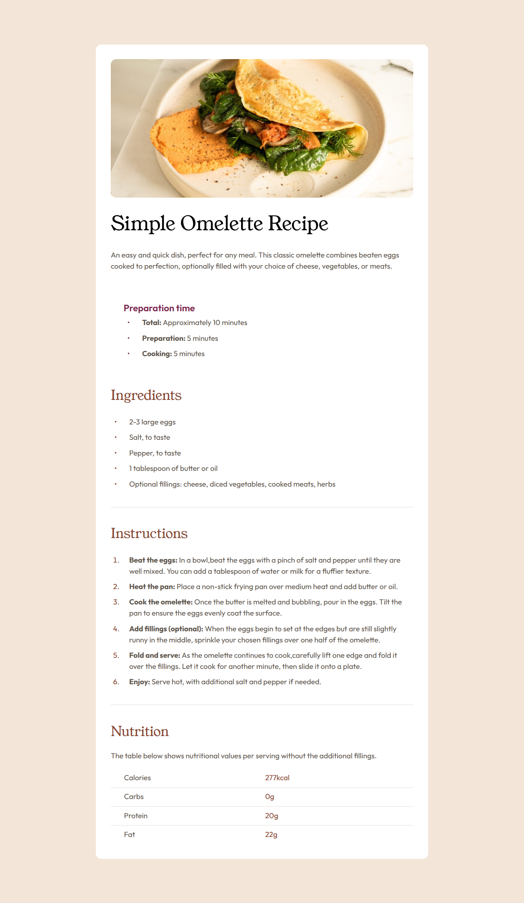

# Frontend Mentor - Recipe page solution

This is a solution to the [Recipe page challenge on Frontend Mentor](https://www.frontendmentor.io/challenges/recipe-page-KiTsR8QQKm) 

## Table of contents

- [Overview](#overview)
  - [Screenshot](#screenshot)
  - [Links](#links)
- [My process](#my-process)
  - [Built with](#built-with)
  - [What I learned](#what-i-learned)
  - [Continued development](#continued-development)
  - [Useful resources](#useful-resources)
- [Author](#author)
- [Acknowledgments](#acknowledgments)

## Overview

### Screenshot

Dekstop


Mobile


### Links

- Solution URL: [GitHub](https://github.com/Adamskiee/recipe-page)
- Live Site URL: [Website](https://adamskiee.github.io/recipe-page/)

## My process

### Built with

- Semantic HTML5 markup
- CSS custom properties
- Flexbox

### What I learned


1. Selectors
```css
section:not([class~="overview"]):not([class~="ingredients"]) {
  padding: 2rem 0;
  border-top: 1px solid var(--stone-150);
}
.table .row:not(.row:last-child) {
  border-bottom: 1px solid var(--stone-150);
}
```

2. Functions
```css
.overview {
  gap: clamp(2rem, 8vh, 1rem);
}
.container .image {
  width: calc(100% + 4rem);
}
```

3. Working with image
```css
.container .image {
  width: calc(100% + 4rem);
  margin: -2rem -2rem 0 -2rem;
  border-radius: 0;
}
```

4. Pseudo elements
``` css
ul > li::before {
  content: "•";
  position: absolute;
  left: 0;
  font-size: 1rem;
}
```

### Continued development

I would like to learn more about how can I use grid in my project, and how can I efficiently use functions and animations.

### Useful resources

- [W3schools](https://www.w3schools.com/) - This helped me to know more about how css properties works.

## Author

- Frontend Mentor - [@Adamskiee](https://www.frontendmentor.io/profile/Adamskiee)

## Acknowledgments

I would like to thanks for the [Fronend Mentor](https://www.frontendmentor.io/) that gives me a whole understanding on the basics of the HTML and CSS, for its feedback to give and the mockup that it gave me to practice.
